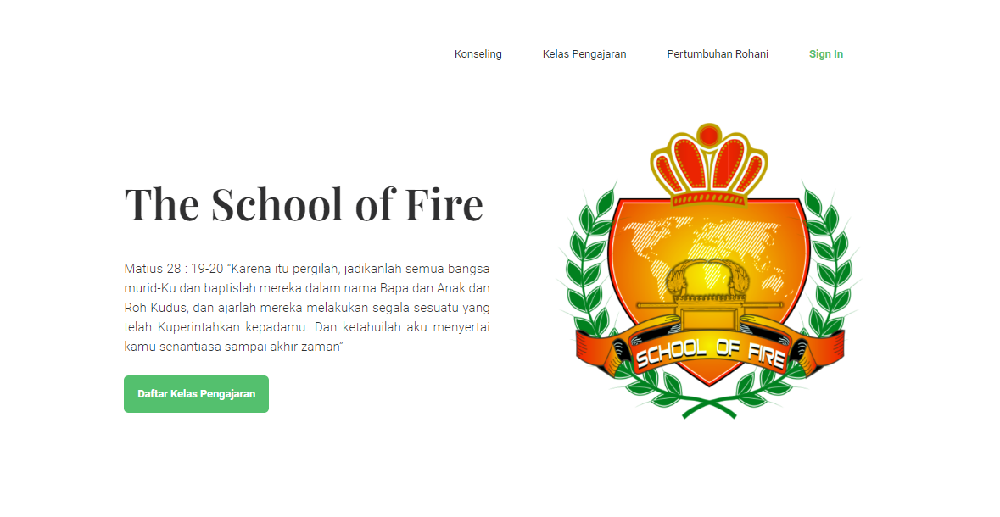
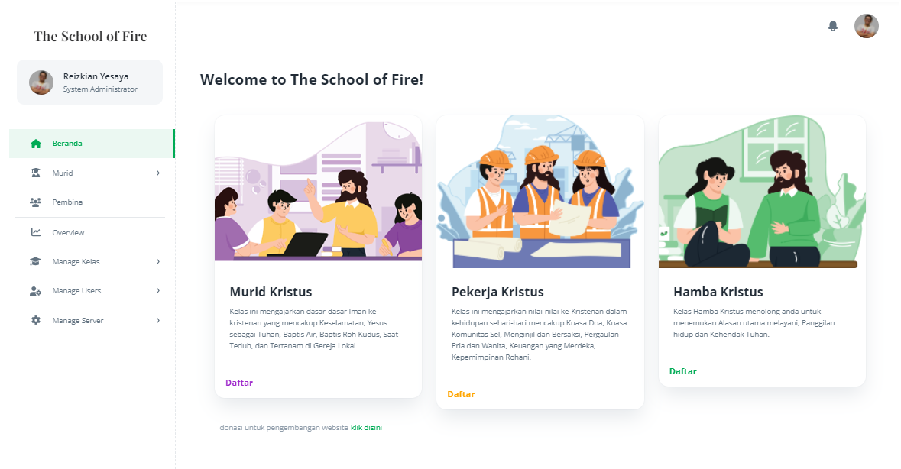
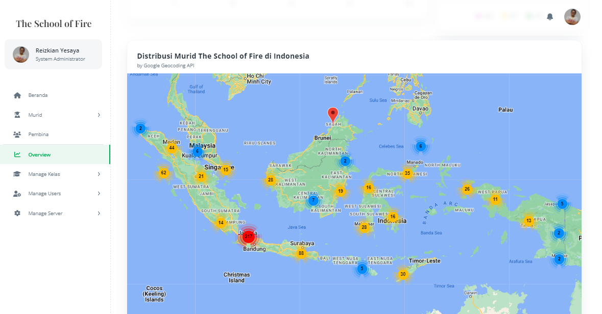

# **The School of Fire - Web App**

**About The Web App:** A Dashboard to manage Bible Online Course ([click here to open](https://the-school-of-fire.web.app/))

**About The Fire Community:** A Youth Ministry Church [Kemah Daud Yogyakarta](https://www.instagram.com/fire_community/), Indonesia.




_Artwork by [Andrea Pangestu](https://www.instagram.com/cidea.art/)_

_Note: This repo still in **active development**._

for preview please login using this account <br> email: tsof.admin@gmail.com <br>passw: tsof123

| Technology Stack                                             |
| ------------------------------------------------------------ |
| [React JS](https://reactjs.org/)                             |
| [Redux](https://redux-toolkit.js.org/)                       |
| [Material UI](https://mui.com/)                              |
| [Node JS](https://nodejs.org/en/)                            |
| [Cloud Function](https://cloud.google.com/functions/docs)    |
| [Firebase Hosting](https://firebase.google.com/docs/hosting) |

run the following command in terminal to clone git repository

```bash
# clone the repository
$ git clone https://github.com/reizkian/tsof.git

# install dependencies
$ cd tsof
$ npm install

# start react-app
$ npm start
```

_Note: there are several environment variable that is not available for firebase local server emulation._
